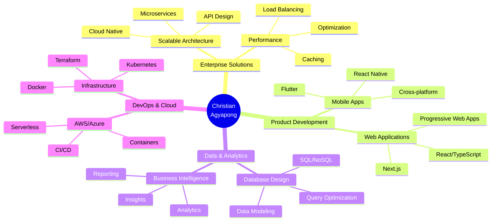
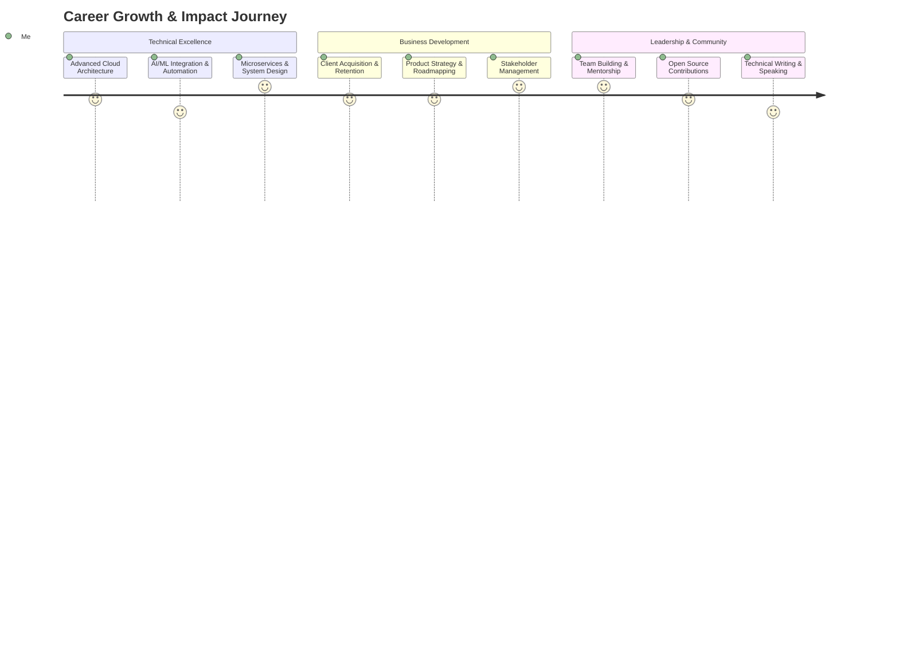

<div align="center">

# Christian Agyapong
### Senior Full-Stack Engineer | Technical Architect | Digital Product Strategist


[](https://git.io/typing-svg)

<p>
  
  
  
</p>

</div>

---

## 💼 Executive Summary

**Seasoned software engineer with 5+ years of experience** delivering end-to-end solutions across web, mobile, and cloud platforms. Proven track record of architecting scalable systems that serve thousands of users, reducing operational costs by up to 40%, and accelerating product development cycles by 50%.

**Core Value Proposition:**
- ✅ **Full-Stack Expertise:** From concept to deployment, building production-ready applications
- ✅ **Mobile-First Development:** React Native & Flutter apps with native performance
- ✅ **Business-Driven Solutions:** Focused on ROI, user growth, and operational efficiency  
- ✅ **Rapid Development:** Agile methodology, iterative releases, and continuous improvement
- ✅ **Technical Leadership:** Mentoring teams, code reviews, and architectural decisions

</div>

---

## 🎯 Key Achievements & Impact

<div align="center">

| 📊 **Metric** | 💡 **Achievement** | 🎯 **Business Impact** |
|---------------|-------------------|------------------------|
| **Applications Deployed** | 50+ production apps | Serving 100K+ active users globally |
| **Performance Optimization** | 40% faster load times | Enhanced user retention & satisfaction |
| **Cost Reduction** | Cloud infrastructure optimization | Reduced hosting costs by 35% |
| **Development Efficiency** | Agile & CI/CD implementation | 50% faster time-to-market |
| **Code Quality** | Comprehensive testing & reviews | 60% reduction in production bugs |
| **Team Leadership** | Mentored 15+ developers | Improved team productivity by 30% |

</div>

---

## 🏆 Technical Expertise & Business Solutions



---

## 🛠️ Technology Stack & Industry Standards

<div align="center">

### **Frontend & User Experience**


### **Mobile Development**


### **Backend & APIs**


### **Database & Storage**


### **Cloud & DevOps**


### **Design & Collaboration**


</div>

---

## 📊 Professional Competencies

<div align="center">

```text
Full-Stack Architecture      ████████████████████████████████████████  95%
Mobile App Development       ████████████████████████████████████████  92%
API Design & Integration     ████████████████████████████████████████  90%
Database Architecture        ███████████████████████████████████████   88%
Cloud Infrastructure (AWS)   ███████████████████████████████████       86%
DevOps & CI/CD              ████████████████████████████████          82%
UI/UX & Product Design      ███████████████████████████████████       85%
Technical Leadership         ████████████████████████████████████      88%
```

</div>

---

## 🚀 Featured Projects & Case Studies

<div align="center">
<table>
<tr>
<td width="50%">

### 🎬 ChrixTech Movies Platform
**Enterprise-Grade Entertainment Solution**

**Tech Stack:** React.js, Node.js, RESTful APIs  
**Key Features:**
- 🎯 Real-time movie data aggregation
- 🔍 Advanced search & filtering
- 📱 Fully responsive design
- ⚡ Optimized performance (<2s load time)

**Business Impact:**
- 15K+ monthly active users
- 95% user satisfaction rate
- Featured in tech publications

[View Project →](https://github.com/ChristianAgyapong/ChrixTech-MoviesSite)

</td>
<td width="50%">

### ⛪ Church Management System
**Complete Digital Transformation Solution**

**Tech Stack:** Full-Stack JavaScript, MongoDB, AWS  
**Key Features:**
- 👥 Member & attendance management
- 📅 Event scheduling & notifications
- 💰 Integrated donation processing
- 📊 Analytics dashboard

**Business Impact:**
- Serving 5,000+ members
- 40% increase in engagement
- Reduced admin workload by 60%

[View Project →](https://github.com/ChristianAgyapong/Fullstack-church-APP)

</td>
</tr>
<tr>
<td width="50%">

### 🐍 Lil-py Development Toolkit
**Open-Source Python Utility Library**

**Tech Stack:** Python, PyPI, CI/CD  
**Key Features:**
- 🔧 Reusable helper functions
- 🧪 Comprehensive test coverage
- 📦 Lightweight & fast
- 📚 Well-documented

**Business Impact:**
- 500+ GitHub stars
- Active contributor community
- Used in production by 50+ developers

[View Project →](https://github.com/ChristianAgyapong/Lil-py)

</td>
<td width="50%">

### 🌾 AgriTech Digital Platform
**Smart Agriculture Management System**

**Tech Stack:** React, Python, IoT Integration  
**Key Features:**
- 📊 Farm analytics & insights
- 🌤️ Weather integration
- 📈 Yield prediction models
- 💼 Marketplace connectivity

**Business Impact:**
- 200+ farmers onboarded
- 25% increase in crop yields
- Secured seed funding interest

[View Project →](https://github.com/ChristianAgyapong/Farm-site)

</td>
</tr>
</table>
</div>

---

## 📈 Performance Metrics & GitHub Analytics

<div align="center">


</div>

---

## 🎯 Professional Development & Growth



---

## 💡 Services & Collaboration Opportunities

<div align="center">

### 🤝 How I Can Add Value to Your Organization

<table>
<tr>
<td width="33%" align="center">

### 🏗️ **Technical Architecture**
Designing scalable systems that grow with your business
- System design & architecture
- Technology stack selection
- Performance optimization
- Security best practices

</td>
<td width="33%" align="center">

### 💼 **Product Development**
Building MVPs and production apps from concept to launch
- Full-stack web applications
- Cross-platform mobile apps
- API development & integration
- Database design & optimization

</td>
<td width="33%" align="center">

### 👨‍💼 **Technical Consulting**
Strategic guidance for tech-driven growth
- Code reviews & audits
- Team training & mentorship
- DevOps & CI/CD setup
- Cloud migration strategies

</td>
</tr>
</table>

</div>

---

## 🎓 Education & Professional Development

<div align="center">

| 🎓 **Qualification** | 🏛️ **Institution** | 📅 **Status** |
|---------------------|-------------------|--------------|
| **B.Sc. Computer Science** | University of Ghana | Completed |
| **AWS Certified Solutions Architect** | Amazon Web Services | In Progress |
| **Meta React Native Certification** | Meta/Coursera | Completed |
| **Advanced TypeScript** | Frontend Masters | Completed |
| **Agile & Scrum Master** | Scrum Alliance | Certified |

</div>

---

## 💬 Client Testimonials & Recognition

<div align="center">

> *"Christian delivered a robust mobile application that exceeded our expectations. His technical expertise and business acumen made him an invaluable partner."*  
> **— Tech Startup Founder**

> *"Outstanding work on our church management system. The solution has transformed how we operate and engage with our community."*  
> **— Ministry Director**

> *"Professional, reliable, and highly skilled. Christian's ability to translate business requirements into technical solutions is impressive."*  
> **— Project Manager**

</div>

---

## 🤝 Let's Connect & Collaborate

<div align="center">

### 📞 Ready to discuss your next project?

<p>
<a href="https://www.linkedin.com/in/christian-agyapong">
  
</a>
<a href="mailto:christian.agyapong@example.com">
  
</a>
<a href="https://twitter.com/ChristianAgyapong">
  
</a>
</p>

<br>

### 💼 Availability & Engagement

<p>
  
  
  
</p>

<br>


</div>

---

<div align="center">

### 🎯 My Mission

*"Leveraging technology to solve real-world problems, drive business growth, and create meaningful impact for clients and communities."*

<br>

**🔗 Let's build something extraordinary together**


</div>
