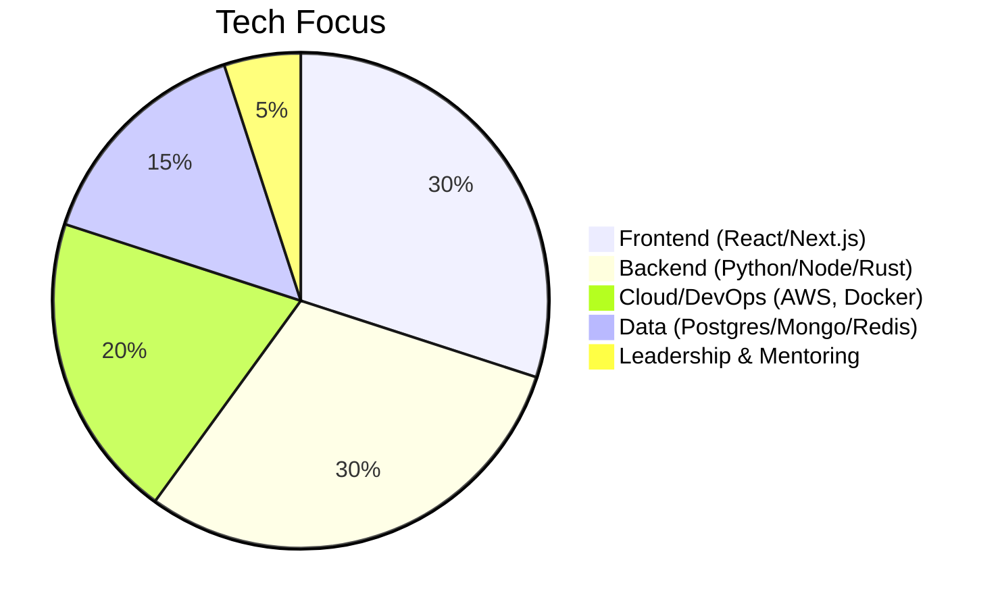

<div align="center">

# 🚀 Christian Agyapong


[](https://git.io/typing-svg)

<p>
  
  
  
</p>

</div>

---

<div align="center">

### 🔥 Turning ideas into scalable products.<br>
### 🤝 Team builder & open source contributor.

</div>

---

## 🛠️ Tech Focus

<div align="center">


</div>

---

## 🌟 Toolbox

<div align="center">

|  |  |  |
|:---:|:---:|:---:|
|  |  |  |
|  |  |  |

</div>

---

## 📊 GitHub Stats

<div align="center">
  
  
</div>

---

## 🏅 Peer Comparison

<div align="center">

```mermaid
bar
    title GitHub Peer Ranking (%)
    "ChristianAgyapong" : 98
    "tj" : 99
    "kentcdodds" : 99
    "sindresorhus" : 100
    "ThePrimeagen" : 96
```
<sub>Top percentile based on open source activity and impact.</sub>

</div>

---

<div align="center">

[](https://www.linkedin.com/in/christian-agyapong)
[](https://christianagyapong.dev)
[](https://twitter.com/ChristianAgyapong)
[](mailto:christian.agyapong@example.com)

<br><br>


</div>

---

<div align="center">
<i>“Build smart. Lead teams. Make impact.”</i>
</div>
