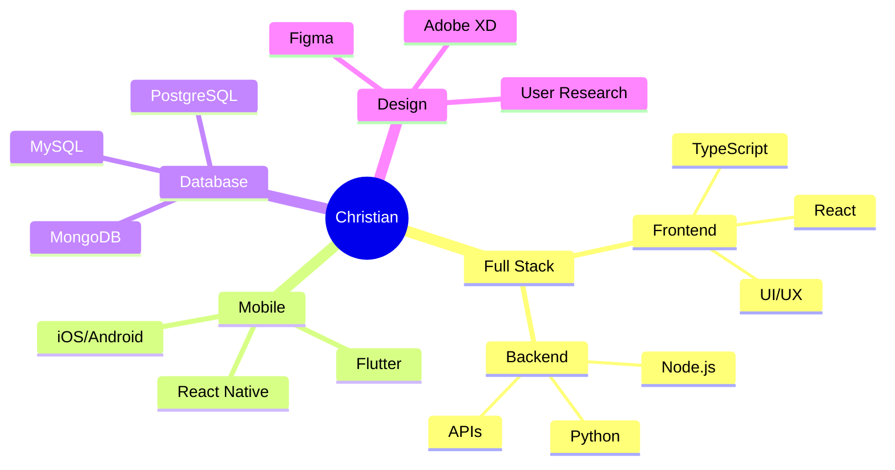
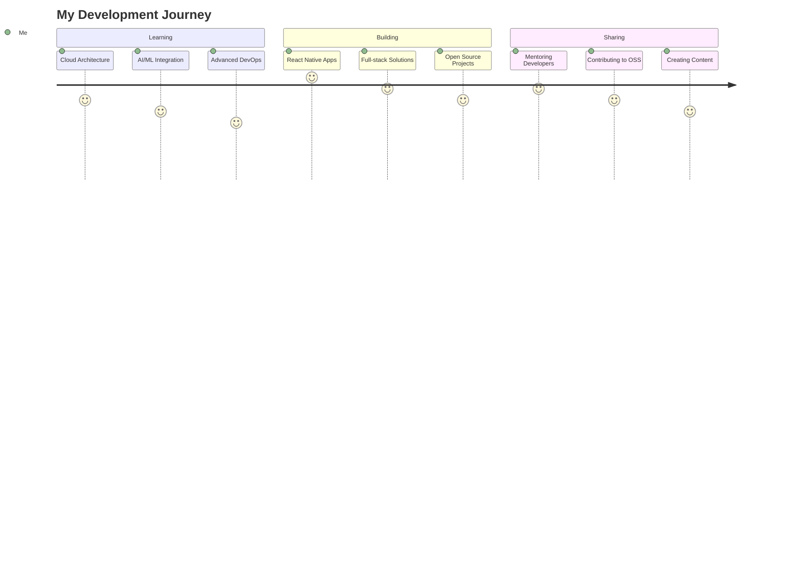

<div align="center">

# 🚀 Christian Agyapong


[](https://git.io/typing-svg)

<p>
  
  
  
</p>

</div>

---

## 🎯 Professional Focus



---

## 🛠️ Tech Stack Arsenal

<div align="center">

### Frontend & Mobile


### Backend & Database


### Design & Tools


</div>

---

## 📊 Skills Proficiency

<div align="center">

```text
Frontend Development    ████████████████████████████████████  90%
Backend Development     ███████████████████████████████████   85%
Mobile Development      ████████████████████████████████████  88%
UI/UX Design           ██████████████████████████████████    80%
Database Management    ███████████████████████████████████   85%
DevOps & Cloud         ████████████████████████████          75%
```

</div>

---

## 🚀 Project Showcase

<div align="center">
<table>
<tr>
<td width="50%">

### 🎬 ChrixTech Movies
**Modern movie discovery with sleek UI**
- React.js Frontend
- Movie Database Integration
- Responsive Design

[View Project →](https://github.com/ChristianAgyapong/ChrixTech-MoviesSite)

</td>
<td width="50%">

### ⛪ Church Management
**Complete church management solution**
- Member Portal
- Event Scheduling  
- Donation Tracking

[View Project →](https://github.com/ChristianAgyapong/Fullstack-church-APP)

</td>
</tr>
<tr>
<td width="50%">

### 🐍 Lil-py Utils
**Python development utilities**
- Helper Functions
- Development Tools
- Open Source

[View Project →](https://github.com/ChristianAgyapong/Lil-py)

</td>
<td width="50%">

### 🌾 AgriTech Platform
**Connecting farmers with technology**
- Farm Management
- Modern Solutions
- Tech Integration

[View Project →](https://github.com/ChristianAgyapong/Farm-site)

</td>
</tr>
</table>
</div>

---

## 📈 GitHub Analytics

<div align="center">


</div>

---

## 🎯 Current Journey



---

## 🤝 Let's Connect

<div align="center">

<a href="https://twitter.com/ChristianAgyapong">
  
</a>
<a href="https://www.linkedin.com/in/christian-agyapong">
  
</a>
<a href="mailto:christian.agyapong@example.com">
  
</a>

<br><br>


</div>

---

<div align="center">

*"Building innovative solutions, creating meaningful impact"*


</div>
