# 👋 Hi, I'm Christian Agyapong

<div align="center">
  
  
  [](https://git.io/typing-svg)
</div>

## 🚀 Software Engineer | Full-Stack Developer | Problem Solver

**📍 Based in Accra, Ghana** • **🌍 Building solutions with global impact**

I'm a passionate software engineer who transforms ideas into scalable, user-centric applications. With expertise spanning full-stack development, I specialize in creating robust web applications and innovative digital solutions that drive business value.

---

## 📊 Professional Overview

<div align="center">
  
  
</div>

---

## 🎯 What I Do

<table>
<tr>
<td width="50%">

### 🎨 Development Process

```mermaid
graph TD
    A[💡 Ideation] --> B[🔍 Research & Planning]
    B --> C[🎨 Design & Architecture]
    C --> D[⚡ Development]
    D --> E[🧪 Testing & Quality]
    E --> F[🚀 Deployment]
    F --> G[📊 Optimization]
    G --> A
    
    style A fill:#e1f5fe
    style D fill:#f3e5f5
    style F fill:#e8f5e8
```


</td>
<td width="50%">

### 📈 Core Expertise
- **💼 Full-Stack Development:** End-to-end application delivery
- **🏗️ System Architecture:** Scalable, maintainable solutions
- **📊 Data Engineering:** Analytics & visualization platforms  
- **🤝 Technical Leadership:** Mentoring & cross-functional collaboration
- **🌱 Innovation:** Emerging tech integration & best practices

</td>
</tr>
</table>

---

## 💻 Technology Arsenal

### 🔧 Core Stack

<table>
<tr>
<td valign="top" width="33%">

**Frontend Excellence**
```
🎨 React & Next.js
📝 TypeScript
🎯 Modern CSS & Tailwind
📱 Progressive Web Apps
⚡ Performance Optimization
```


</td>
<td valign="top" width="33%">

**Backend Mastery**
```
🐍 Python & FastAPI
🌐 Node.js & Express
🦀 Rust for Performance
🔗 GraphQL & REST APIs
🔐 Authentication & Security
```


</td>
<td valign="top" width="33%">

**Infrastructure & Data**
```
🗄️ PostgreSQL & MongoDB
⚡ Redis Caching
🐳 Docker & Kubernetes
☁️ AWS Cloud Services
🔄 CI/CD Pipelines
```


</td>
</tr>
</table>

---

## 🏗️ Architecture Philosophy

<div align="center">


</div>

---

## 🎯 Current Focus & Innovation

<table>
<tr>
<td width="50%">

### 🔬 Exploring Now
- **🤖 AI/ML Integration** - Embedding intelligence into applications
- **🏗️ Serverless Architecture** - Building scalable, cost-effective solutions  
- **🌐 Web3 Technologies** - Decentralized application development
- **🔍 Advanced TypeScript** - Type-safe, maintainable codebases
- **📊 Real-time Analytics** - Data-driven decision making platforms

</td>
<td width="50%">

### 📈 Growth Trajectory


</td>
</tr>
</table>

---

## 🌟 Professional Philosophy

<div align="center">

> *"Excellence in software engineering isn't just about writing code—it's about crafting solutions that solve real problems, scale gracefully, and create lasting value for users and businesses alike."*

</div>

**My Approach:**
- 🎯 **Problem-First Thinking** - Understanding the 'why' before the 'how'
- 🏗️ **Scalable by Design** - Building for tomorrow, not just today  
- 👥 **User-Centric Development** - Technology should serve people
- 🔄 **Continuous Evolution** - Embracing change and learning opportunities
- 🤝 **Collaborative Excellence** - Great software is a team effort

---

## 🚀 Let's Build Something Amazing

<div align="center">

[](https://www.linkedin.com/in/christian-agyapong)
[](https://christianagyapong.dev)
[](https://twitter.com/ChristianAgyapong)
[](mailto:christian.agyapong@example.com)

</div>

<div align="center">

### 💡 Open to opportunities in:
**Senior Full-Stack Roles** • **Technical Leadership** • **Innovative Startups** • **Open Source Collaboration**

</div>

---

<div align="center">
  
  <br><br>
  <i>⭐ "Building the future, one commit at a time" ⭐</i>
</div>
