<div align="center">
  
  # 🌟 Christian Agyapong
  
  
  
  [](https://git.io/typing-svg)
  
  <p align="center">
    
    
    
  </p>

</div>

---

<div align="center">
  
  ### 🎯 *Building Tomorrow's Digital Landscape*
  
  *Passionate full-stack engineer specializing in scalable, user-centric applications that drive measurable business impact. Expert in modern web technologies with a focus on clean architecture and innovative solutions.*
  
</div>

---

## 📊 **Professional Metrics**

<div align="center">
  
  
  
  
</div>

---

## 🚀 **Core Expertise**

<table>
<tr>
<td width="50%" align="center">

### 🎨 **Development Philosophy**

```mermaid
graph TD
    A["🎯<br/>Strategy"] --> B["🔍<br/>Research"]
    B --> C["🎨<br/>Design"]
    C --> D["⚡<br/>Build"]
    D --> E["🧪<br/>Test"]
    E --> F["🚀<br/>Deploy"]
    F --> G["📊<br/>Optimize"]
    G --> A
    
    classDef primary fill:#00D4AA,stroke:#fff,stroke-width:3px,color:#000
    classDef secondary fill:#FF6B6B,stroke:#fff,stroke-width:2px,color:#fff
    classDef tertiary fill:#4ECDC4,stroke:#fff,stroke-width:2px,color:#000
    
    class A,D,F primary
    class B,E,G secondary
    class C tertiary
```



</td>
<td width="50%">

### 📈 **Impact Areas**

<div align="left" style="padding: 20px;">

**🏗️ Architecture Excellence**  
*Designing scalable, maintainable systems*

**⚡ Performance Optimization**  
*Building lightning-fast applications*

**🔒 Security Integration**  
*Implementing robust security practices*

**👥 Technical Leadership**  
*Mentoring teams & driving innovation*

**📊 Data-Driven Solutions**  
*Creating analytics & visualization platforms*

</div>

</td>
</tr>
</table>

---

## 💻 **Technology Mastery**

<div align="center">
  
  ### 🎯 **Full-Stack Arsenal**
  
</div>

<table>
<tr>
<td width="33%" align="center">

**🎨 Frontend Excellence**

```
React Ecosystem
Next.js 14
TypeScript
Tailwind CSS
Progressive Web Apps
```

<p align="center">
  
  
  
  
</p>

</td>
<td width="33%" align="center">

**⚡ Backend Mastery**

```
Python & FastAPI
Node.js & Express
Rust Performance
GraphQL & REST
Microservices
```

<p align="center">
  
  
  
  
</p>

</td>
<td width="33%" align="center">

**🏗️ Infrastructure & DevOps**

```
PostgreSQL & MongoDB
Redis Caching
Docker & Kubernetes  
AWS Cloud Services
CI/CD Automation
```

<p align="center">
  
  
  
  
</p>

</td>
</tr>
</table>

---

## 🎯 **Innovation Focus**

```mermaid
mindmap
  root)Christian's Tech Vision(
    🤖 AI Integration
      Machine Learning Models
      Natural Language Processing
      Intelligent Automation
      Predictive Analytics
    🏗️ Modern Architecture
      Serverless Computing
      Event-Driven Design
      Microservices
      Clean Code Principles
    🌐 Web3 & Blockchain
      DeFi Applications
      Smart Contracts
      Decentralized Systems
      Crypto Integration
    ☁️ Cloud Excellence
      AWS Solutions Architecture
      Kubernetes Orchestration
      Infrastructure as Code
      DevOps Best Practices
```

<div align="center">



</div>

---

## 🌟 **Professional Journey**

<div align="center">


</div>

---

## 🎨 **Design Philosophy**

<div align="center">
  
  <table>
  <tr>
  <td width="50%" align="center">
  
  **🎯 Core Principles**
  
  ```mermaid
  pie title Development Priorities
      "User Experience" : 30
      "Code Quality" : 25  
      "Performance" : 20
      "Security" : 15
      "Innovation" : 10
  ```
  
  </td>
  <td width="50%" align="center">
  
  **⚡ Values in Action**
  
  <div align="left">
  
  🎯 **User-Centric Design**  
  *Every line of code serves a purpose*
  
  🏗️ **Scalable Architecture**  
  *Building for growth and evolution*
  
  🔒 **Security by Design**  
  *Protection built into the foundation*
  
  ⚡ **Performance First**  
  *Speed and efficiency as priorities*
  
  🤝 **Collaborative Excellence**  
  *Great software is a team effort*
  
  </div>
  
  </td>
  </tr>
  </table>
  
</div>

---

## 💭 **Professional Motto**

<div align="center">
  
  
  
</div>

---

## 🌐 **Connect & Collaborate**

<div align="center">
  
  <table>
  <tr>
  <td align="center" width="25%">
    <a href="https://www.linkedin.com/in/christian-agyapong">
      
      <br><strong>Professional Network</strong>
    </a>
  </td>
  <td align="center" width="25%">
    <a href="https://christianagyapong.dev">
      
      <br><strong>Featured Projects</strong>
    </a>
  </td>
  <td align="center" width="25%">
    <a href="https://twitter.com/ChristianAgyapong">
      
      <br><strong>Tech Insights</strong>
    </a>
  </td>
  <td align="center" width="25%">
    <a href="mailto:christian.agyapong@example.com">
      
      <br><strong>Direct Contact</strong>
    </a>
  </td>
  </tr>
  </table>
  
</div>

---

<div align="center">
  
  ### 🚀 **Open to Strategic Opportunities**
  
  
  
  
  
</div>

---

<div align="center">
  
  
  
  
  <br><br>
  
  
  
</div>
