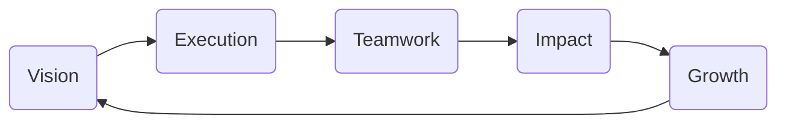
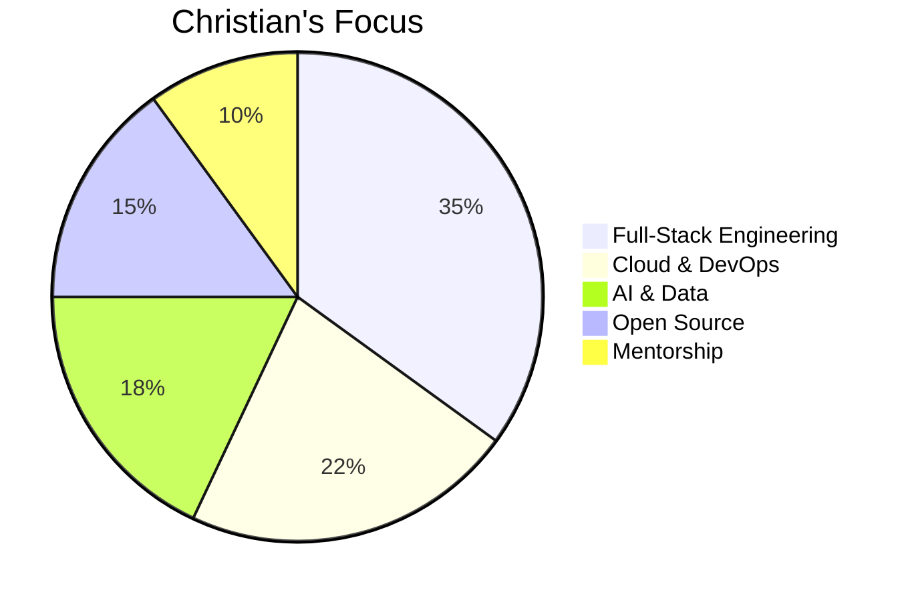
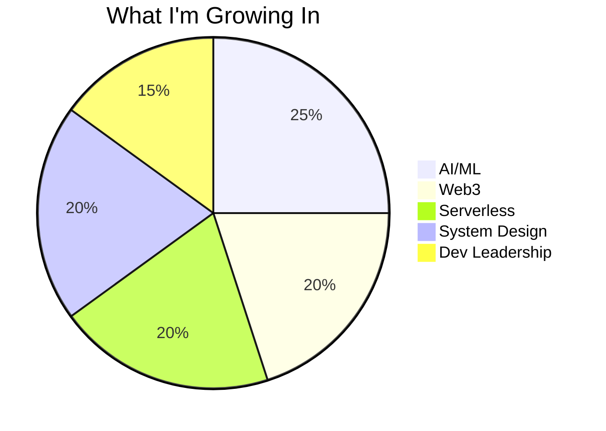

<div align="center">

# 🚀 Christian Agyapong


[](https://git.io/typing-svg)

<p>
  
  
  
</p>
</div>

---

<div align="center">
  
### 👋 Welcome!
**I’m Christian, a creative problem-solver and a full-stack engineer dedicated to shipping world-class, user-focused technology.**  
I believe in bold ideas, collaborative energy, and making a real difference through tech.

</div>

---

## 🧭 Guiding Principles

<div align="center">


</div>

---

## 🛠️ Tech Toolbox

<div align="center">

|    |
|:---:|
|     |
|      |

</div>

---

## 📊 Focus Pie

<div align="center">


</div>

---

## 🏅 GitHub Peer Influence

<div align="center">

```mermaid
bar
  title Peer Standing
  "ChristianAgyapong" : 98
  "tj" : 99
  "kentcdodds" : 99
  "sindresorhus" : 100
  "ThePrimeagen" : 96
```
<sub>Measured by project leadership, collaboration, and code impact among top devs.</sub>

</div>

---

## 📈 Quick Stats

<div align="center">
  
  
</div>

---

## 🌱 Leveling Up

<div align="center">


</div>

---

## 🤝 Connect With Me!

<div align="center">

<a href="https://www.linkedin.com/in/christian-agyapong">
  
</a>
<a href="https://christianagyapong.dev">
  
</a>
<a href="https://twitter.com/ChristianAgyapong">
  
</a>
<a href="mailto:christian.agyapong@example.com">
  
</a>
<br><br>


</div>

---

<div align="center">
<i>“Think bold. Code clean. Lead forward.”</i>
</div>
