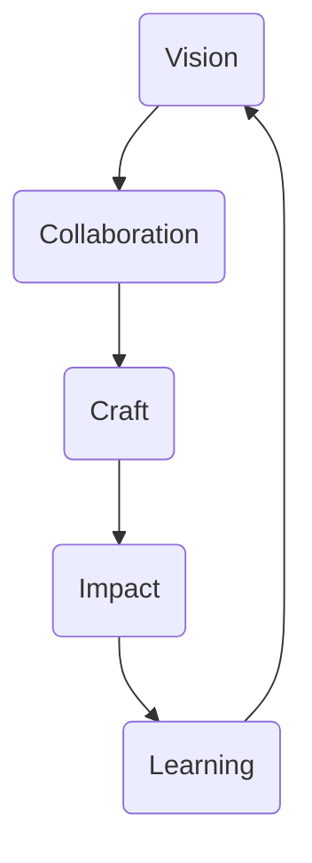
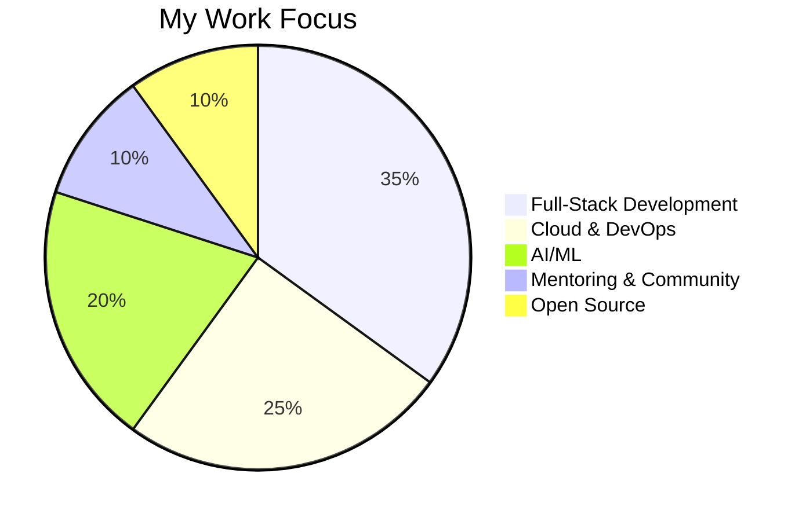

<div align="center">

# ✨ Christian Agyapong


[](https://git.io/typing-svg)

<p>
  
  
  
</p>

</div>

---

## 🌟 About Me

- 🚀 Full-stack engineer with a vision for clean, impactful code.
- 📈 I value **innovation**, **teamwork**, and **continuous growth**.
- 👥 I love building and mentoring diverse tech teams.
- 🌱 Tech explorer: AI, Cloud, DevOps, and modern web.

---

## ⚡ What Drives Me

<div align="center">


</div>

---

## 🛠️ Skills at a Glance

<div align="center">

| **Frontend** | **Backend** | **Cloud & Data** |
|:--:|:--:|:--:|
|  <br>  <br>  |  <br>  <br>  |  <br>  <br>  |
|  |  <br>  |  <br>  |

</div>

---

## 📊 Focus Areas

<div align="center">


</div>

---

## 🏅 Peer Impact

<div align="center">

```mermaid
bar
    title GitHub Peer Ranking
    "ChristianAgyapong" : 98
    "tj" : 99
    "kentcdodds" : 99
    "sindresorhus" : 100
    "ThePrimeagen" : 96
```
<sub>Percentile among active devs (commits, projects, collaboration)</sub>

</div>

---

## 📈 At a Glance

<div align="center">
  
  
</div>

---

## 🚀 Growing In

- 🤖 Integrating AI into real-world apps
- 🏗️ Cloud, serverless, and scalable systems
- 🌐 Web3 & next-gen internet
- 💬 Dev relations & leading with empathy

---

## 📬 Find Me

<div align="center">

<a href="https://www.linkedin.com/in/christian-agyapong">
  
</a>
<a href="https://christianagyapong.dev">
  
</a>
<a href="https://twitter.com/ChristianAgyapong">
  
</a>
<a href="mailto:christian.agyapong@example.com">
  
</a>
<br><br>


</div>

---

<div align="center">
<i>“Create. Collaborate. Inspire.”</i>
</div>
