# 👋 Hi, I'm Christian Agyapong

<div align="center">
  
  
  [](https://git.io/typing-svg)
</div>

## 🚀 Software Engineer | Full-Stack Developer | Problem Solver

**📍 Based in Accra, Ghana** • **🌍 Building solutions with global impact**

I'm a passionate software engineer who transforms ideas into scalable, user-centric applications. With expertise spanning full-stack development, I specialize in creating robust web applications and innovative digital solutions that drive business value.

---

## 📊 GitHub Analytics Dashboard

<div align="center">
  
  
</div>

<div align="center">
  
</div>

<div align="center">
  
</div>

---

## 🎯 Professional Highlights

<table>
<tr>
<td width="50%">

### 🎨 What I Do

```mermaid
graph TD
    A[💡 Ideas] --> B[🔍 Analysis]
    B --> C[🎨 Design]
    C --> D[⚡ Development]
    D --> E[🧪 Testing]
    E --> F[🚀 Deployment]
    F --> G[📊 Monitoring]
    G --> A
```


</td>
<td width="50%">

### 📈 Impact Areas
- **💼 Full-Stack Expertise:** End-to-end development
- **🔧 Modern Tech Stack:** Cutting-edge frameworks
- **📊 Data-Driven:** Analytics & visualization
- **🤝 Team Collaboration:** Cross-functional leadership
- **🌱 Continuous Learning:** Emerging technologies

</td>
</tr>
</table>

---

## 💻 Technical Expertise & Proficiency

<div align="center">

### 🎯 Skills Radar Chart
```mermaid
radar
    title Technical Skills Proficiency
    "Frontend Development" : 0.9
    "Backend Development" : 0.85
    "Database Management" : 0.8
    "DevOps & Cloud" : 0.75
    "UI/UX Design" : 0.7
    "AI/ML" : 0.6
    "Mobile Development" : 0.65
    "Blockchain/Web3" : 0.5
```

</div>

### 🔧 Technology Stack

<table>
<tr>
<td valign="top" width="33%">

#### Frontend


</td>
<td valign="top" width="33%">

#### Backend & Languages


</td>
<td valign="top" width="33%">

#### Database & Tools


</td>
</tr>
</table>

### 📊 Development Journey Timeline


---

## 🏆 Featured Projects Architecture

```mermaid
graph TB
    subgraph "🌐 Frontend Layer"
        A[React/Next.js Apps]
        B[Mobile Apps]
        C[PWAs]
    end
    
    subgraph "⚡ API Layer"
        D[FastAPI Services]
        E[GraphQL APIs]
        F[REST Endpoints]
    end
    
    subgraph "🗄️ Data Layer"
        G[(PostgreSQL)]
        H[(MongoDB)]
        I[(Redis Cache)]
    end
    
    subgraph "☁️ Cloud Infrastructure"
        J[AWS/Vercel]
        K[Docker Containers]
        L[CI/CD Pipelines]
    end
    
    A --> D
    B --> E
    C --> F
    D --> G
    E --> H
    F --> I
    G --> J
    H --> K
    I --> L
```



---

## 📈 Contribution Patterns & Activity

<div align="center">
  
</div>

<div align="center">
  
  
</div>

---

## 🎯 Current Focus Areas


---

## 🌟 Professional Philosophy

```mermaid
flowchart TD
    A[👨‍💻 Clean Code] --> B[🚀 Scalable Solutions]
    B --> C[👥 User-Centric Design]
    C --> D[🔄 Continuous Learning]
    D --> E[🌍 Global Impact]
    E --> A
    
    style A fill:#2196F3,stroke:#fff,stroke-width:2px,color:#fff
    style B fill:#4CAF50,stroke:#fff,stroke-width:2px,color:#fff
    style C fill:#FF9800,stroke:#fff,stroke-width:2px,color:#fff
    style D fill:#9C27B0,stroke:#fff,stroke-width:2px,color:#fff
    style E fill:#F44336,stroke:#fff,stroke-width:2px,color:#fff
```

<div align="center">



</div>

> *"Code is not just about solving problems—it's about crafting elegant solutions that stand the test of time and create meaningful impact."*

---

## 📫 Let's Connect & Collaborate

<div align="center">

[](https://www.linkedin.com/in/christian-agyapong)
[](https://twitter.com/ChristianAgyapong)
[](https://christianagyapong.dev)
[](mailto:christian.agyapong@example.com)

</div>

<div align="center">

### 💡 Open to opportunities in:
**Full-Stack Development** • **Technical Leadership** • **Startup Ventures** • **Open Source Projects**

</div>

---

<div align="center">
  
  
</div>

<div align="center">
  <i>⭐ "Building the future, one commit at a time" ⭐</i>
</div>
